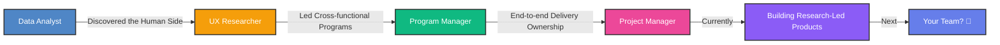

<div align="center">


</div>

<div align="center">


</div>

---


### 👋 About Me

```yaml
name: Sneha Deb Barma
located_in: Bengaluru, India
roles:
  - UX Researcher
  - Program Manager
  - Project Manager
superpower: Connecting the "why" behind user behavior
          to the "what" teams need to build
fun_fact: I write interview guides the way others
          write poetry — with obsessive intentionality 📝
```

### 🎯 What I Bring to the Table

🔍 **UX Research** — Qual & quant methods that de-risk product decisions  
🗺️ **Program Management** — Cross-functional delivery, zero ambiguity  
📋 **Project Management** — Scope, timelines, risks — all under control  
📊 **Data-Informed Design** — Research repositories teams actually revisit  
🤝 **Stakeholder Alignment** — Translating research into language leadership acts on  

<br clear="right"/>

---

<div align="center">

## 🧪 Research & Delivery Toolkit

<table>
<tr>
<td align="center" width="20%">

<br><strong>Figma</strong>
</td>
<td align="center" width="20%">

<br><strong>Jira</strong>
</td>
<td align="center" width="20%">

<br><strong>Python</strong>
</td>
<td align="center" width="20%">

<br><strong>SQL</strong>
</td>
<td align="center" width="20%">

<br><strong>Power BI</strong>
</td>
</tr>
</table>

**Research Methods:** Usability Testing · In-depth Interviews · Contextual Inquiry · Surveys · Card Sorting · Tree Testing · Diary Studies · A/B Testing  
**PM Tools:** Confluence · Notion · Miro · Asana · Roadmunk · Slack  

</div>

---

<div align="center">

## 💥 Impact Highlights

</div>

<table>
<tr>
<td align="center" width="33%">

<br><sub>Usability studies that prevented costly missteps before launch</sub>
</td>
<td align="center" width="33%">

<br><sub>Streamlined research ops & reporting workflows</sub>
</td>
<td align="center" width="33%">

<br><sub>Program structures that keep teams aligned and on-track</sub>
</td>
</tr>
</table>

---

<div align="center">

## 🌈 My Journey


```mermaid
graph LR
    A[Data Analyst] -->|Discovered the Human Side| B[UX Researcher]
    B -->|Led Cross-functional Programs| C[Program Manager]
    C -->|End-to-end Delivery Ownership| D[Project Manager]
    D -->|Currently| E[Building Research-Led Products]
    E -->|Next| F[Your Team? 🚀]

    style A fill:#4F86C6,stroke:#333,stroke-width:2px,color:#fff
    style B fill:#F59E0B,stroke:#333,stroke-width:2px,color:#fff
    style C fill:#10B981,stroke:#333,stroke-width:2px,color:#fff
    style D fill:#EC4899,stroke:#333,stroke-width:2px,color:#fff
    style E fill:#8B5CF6,stroke:#333,stroke-width:2px,color:#fff
    style F fill:#667EEA,stroke:#333,stroke-width:2px,color:#fff
```

</div>

---

<div align="center">

## 🎯 Currently Exploring

</div>

```diff
+ 🔬 Mixed-Methods Research Frameworks at Scale
+ 🤖 AI-Augmented UX Research (LLMs for synthesis & analysis)
+ 🗺️ Strategic Roadmapping & OKR Alignment
+ 🧠 Behavioral Psychology & Decision Science in Product Design
+ 📐 Research Ops & Democratizing Insights Across Orgs
```

---

<div align="center">

## 🧭 My Work Philosophy

<table>
<tr>
<td align="center">

### 🔍
**Listen First**  
The best insights  
live in silences

</td>
<td align="center">

### 🗺️
**Clarity Over Speed**  
Ambiguity costs more  
than a slow start

</td>
<td align="center">

### 📊
**Evidence, Not Opinions**  
Let users be  
your north star

</td>
<td align="center">

### ❤️
**Empathy at Scale**  
Research that moves  
teams, not just decks

</td>
</tr>
</table>

</div>

---

<div align="center">

## 🔥 GitHub Activity


</div>

---

<div align="center">

## 🎵 Current Status

**Mode:** Synthesizing research into actionable insights 🔍  
**Coffee Level:** ☕☕☕☕  
**Favorite Research Method:** Contextual inquiry — context is everything 🏢  
**Dream Collaboration:** A team obsessed with getting things right, not just right now  

</div>

---

<div align="center">

## 📬 Let's Connect

<a href="https://linkedin.com/in/snehadebbarma">
  
</a>
<a href="mailto:snehadebbarma2@gmail.com">
  
</a>
<a href="https://github.com/snehadebbarma">
  
</a>

<br><br>


</div>

---

<div align="center">
<sub>🎨 Crafted with research rigour, program precision, and a lot of sticky notes 📝</sub>
</div>
