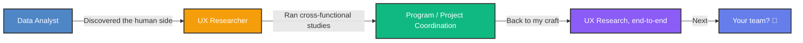

<div align="center">


</div>

<div align="center">


</div>

<div align="center">

### 🌐 [**View My Portfolio → snehadebbarma.vercel.app**](https://snehadebbarma.vercel.app)
*End-to-end UX research, with a full case study you can read in 5 minutes.*

</div>

---

### 👋 About Me

```yaml
name: Sneha Deb Barma
located_in: Bengaluru, India
role: UX Researcher
background: Data Analyst → Program/Project Coordination → UX Research
focus:
  - End-to-end generative & evaluative research
  - Mixed methods (qual + quant)
  - Turning insights into decisions teams act on
fun_fact: I write interview guides the way others write poetry —
          with obsessive intentionality 📝
```

### 🎯 What I Bring to the Table

🔍 **UX Research** — Qual & quant methods that de-risk product decisions  
🗺️ **Research Operations** — Studies run end-to-end: design → recruit → moderate → synthesise  
📊 **Data-Informed Insight** — Behavioral & funnel analysis paired with user voice  
🧩 **Insight Synthesis** — Repositories and journey maps teams actually revisit  
🤝 **Stakeholder Alignment** — Translating research into language leadership acts on  

---

<div align="center">

## 🧪 Research & Delivery Toolkit

</div>

**Research methods:** In-depth Interviews · Usability Testing · Contextual Inquiry · Surveys · Concept & Prototype Testing · Heuristic Evaluation · Card Sorting · Diary Studies  

**Synthesis & analysis:** Affinity Mapping · Personas · Journey Mapping · Funnel & Behavioral Analysis · Thematic Coding  

**Tools:** Figma · FigJam · Miro · Notion · Jira · Confluence · Excel / Google Sheets · SQL *(learning)* · Python *(learning)*  

---

<div align="center">

## ✨ What I Care About in Research

</div>

<table>
<tr>
<td align="center" width="33%">
<strong>🔍 Listen first</strong>
<br><sub>The best insights live in the silences</sub>
</td>
<td align="center" width="33%">
<strong>📊 Evidence, not opinions</strong>
<br><sub>Let users be the north star</sub>
</td>
<td align="center" width="33%">
<strong>🚀 Insight → action</strong>
<br><sub>Research that ships changes, not just decks</sub>
</td>
</tr>
</table>

---

<div align="center">

## 🌈 My Journey


```mermaid
graph LR
    A[Data Analyst] -->|Discovered the human side| B[UX Researcher]
    B -->|Ran cross-functional studies| C[Program / Project Coordination]
    C -->|Back to my craft| D[UX Research, end-to-end]
    D -->|Next| E[Your team? 🚀]

    style A fill:#4F86C6,stroke:#333,stroke-width:2px,color:#fff
    style B fill:#F59E0B,stroke:#333,stroke-width:2px,color:#fff
    style C fill:#10B981,stroke:#333,stroke-width:2px,color:#fff
    style D fill:#8B5CF6,stroke:#333,stroke-width:2px,color:#fff
    style E fill:#667EEA,stroke:#333,stroke-width:2px,color:#fff
```

</div>

---

<div align="center">

## 🔬 Currently Exploring

</div>

```diff
+ Mixed-methods research frameworks
+ AI-augmented UX research (LLMs for synthesis & analysis)
+ Research ops & democratizing insights across teams
+ Behavioral psychology & decision science in product design
```

---

<div align="center">

## 🧭 Featured Work

**🚉 Self-initiated study — Bangalore transit ticketing**  
Why buying a metro ticket still stresses commuters: field observation, interviews, a survey,
and the design directions I'm testing next.

### 👉 [Read the full case study](https://snehadebbarma.vercel.app)

</div>

---

<div align="center">

## 📬 Let's Connect

<a href="https://snehadebbarma.vercel.app">
  
</a>
<a href="https://linkedin.com/in/snehadebbarma">
  
</a>
<a href="mailto:snehadebbarma2@gmail.com">
  
</a>

<br><br>


</div>

<div align="center">
<sub>🎨 Crafted with research rigour and a lot of sticky notes 📝</sub>
</div>
