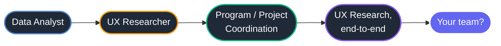

<!-- ════════════════════════════════════════════════════════════════
     SNEHA DEB BARMA · UX RESEARCHER · GitHub Profile README
     ════════════════════════════════════════════════════════════════ -->

<div align="center">


<br/>


<br/><br/>

<a href="https://snehadebbarma.vercel.app">
  
</a>
&nbsp;
<a href="https://linkedin.com/in/snehadebbarma">
  
</a>
&nbsp;
<a href="mailto:snehadebbarma2@gmail.com">
  
</a>

</div>

<br/>

<!-- ─────────────────────────── ABOUT ─────────────────────────── -->

> **UX Researcher** running end-to-end generative & evaluative studies for digital products —
> from study design and recruitment through moderation, synthesis, and the stakeholder readout
> that actually ships changes. I care most about the path from **evidence to decision.**

<div align="center">

`🔍 Mixed Methods` &nbsp; `🗺️ Research Ops` &nbsp; `📊 Behavioral Analysis` &nbsp; `🤝 Stakeholder Alignment`

</div>

<br/>

<!-- ─────────────────────────── FEATURED WORK ─────────────────────────── -->

## &nbsp;🧭&nbsp; Featured Work

<table>
<tr>
<td width="62%" valign="top">

### 🚉 &nbsp;Why buying a metro ticket still stresses Bangalore commuters
**Self-initiated · mixed methods · in progress**

A study born from a daily frustration. I paired **field observation** at stations with
**commuter interviews** and a **survey** to find where ticketing breaks down — then shaped
the findings into design directions I'm testing next.

`Field Observation` · `Interviews` · `Survey` · `Usability (next)`

#### 👉 [**Read the full case study →**](https://snehadebbarma.vercel.app)

</td>
<td width="38%" valign="top">

<br/>

```text
ROUND 1 SNAPSHOT
────────────────
 7   commuter interviews
52   survey responses
 3   stations observed
 4   emerging themes
────────────────
 Round 2: prototype
 + usability testing
```

</td>
</tr>
</table>

<br/>

<!-- ─────────────────────────── TOOLKIT ─────────────────────────── -->

## &nbsp;🧪&nbsp; Research Toolkit

**Generative**  


**Evaluative**  


**Synthesis & Quant**  


**Tools**  


<br/>

<!-- ─────────────────────────── PHILOSOPHY ─────────────────────────── -->

## &nbsp;🧠&nbsp; How I Work

<table>
<tr>
<td align="center" width="25%"><h3>🔍</h3><b>Method follows<br/>the question</b><br/><sub>The lightest method that can answer it credibly</sub></td>
<td align="center" width="25%"><h3>🧾</h3><b>Rigor you<br/>can audit</b><br/><sub>Every finding traces back to its evidence</sub></td>
<td align="center" width="25%"><h3>🤝</h3><b>Built with<br/>the team</b><br/><sub>Shared conviction turns insight into action</sub></td>
<td align="center" width="25%"><h3>🚀</h3><b>Evidence,<br/>not opinions</b><br/><sub>Research that ships changes, not just decks</sub></td>
</tr>
</table>

<br/>

<!-- ─────────────────────────── JOURNEY ─────────────────────────── -->

## &nbsp;🛤️&nbsp; The Path Here


```mermaid
graph LR
    A([Data Analyst]) --> B([UX Researcher])
    B --> C([Program / Project<br/>Coordination])
    C --> D([UX Research,<br/>end-to-end])
    D --> E([Your team?])

    style A fill:#1F2937,stroke:#4F86C6,stroke-width:2px,color:#fff
    style B fill:#1F2937,stroke:#F59E0B,stroke-width:2px,color:#fff
    style C fill:#1F2937,stroke:#10B981,stroke-width:2px,color:#fff
    style D fill:#1F2937,stroke:#8B5CF6,stroke-width:2px,color:#fff
    style E fill:#6366F1,stroke:#fff,stroke-width:2px,color:#fff
```

<br/>

<!-- ─────────────────────────── EXPLORING ─────────────────────────── -->

## &nbsp;🔬&nbsp; Currently Exploring

```diff
+ AI-augmented UX research — using LLMs for synthesis & analysis
+ Mixed-methods frameworks that scale beyond a single study
+ Research ops — democratizing insights across a team
+ Behavioral science & decision-making in product design
```

<br/>

<!-- ─────────────────────────── FOOTER ─────────────────────────── -->

<div align="center">

### &nbsp;📬&nbsp; Let's build research-led products together

<a href="https://snehadebbarma.vercel.app"></a>
<a href="https://linkedin.com/in/snehadebbarma"></a>
<a href="mailto:snehadebbarma2@gmail.com"></a>
<a href="https://github.com/snehadebbarma"></a>

<br/><br/>


<sub>🎨 Crafted with research rigour and a lot of sticky notes</sub>

</div>
